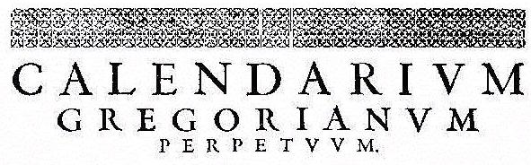
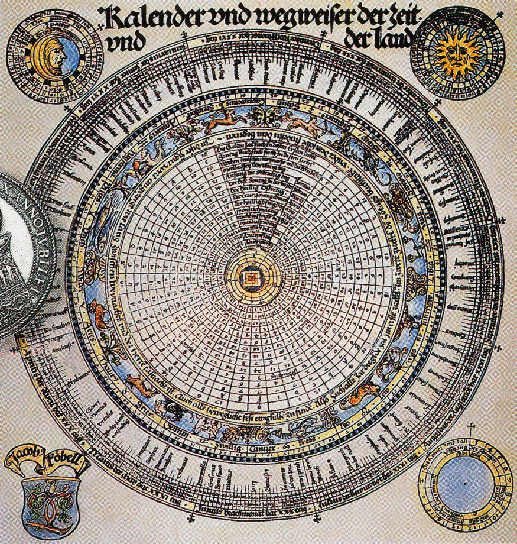

#Gregorian
_A Javascript micro library for converting and displaying dates._


>reform |riˈfôrm|  
>verb [ with obj. ]  
>_1 make changes in (something, typically a social, political, or economic institution or practice) in order to improve it: an opportunity to reform and restructure an antiquated schooling model._

Gregorian is named after the calendar introduced in 1582 by under Pope Gregory XIII's papacy, the calendar we currently use today. It was a **reform** of the Julian calendar to make the year 0.002% shorter and also slightly changed the leap year schedule to omit 3 leap days every 400 years.

##What does it do?
Gregorian is a wrapper for the native Javascript `Date` object that allows you to customize how to display and write dates pretty minutely. It has no dependencies and can be run either in the browser as a global or as a module. Each release is linted with ESLint and tested with Jest to minimize errors.

You can take the same date object and express it like:

```javascript
'April 11, 1988'
'1988-04-11'
'4/11/88'
'Monday, 11 Apr 1988 12:00:00.000AM UTC 00:00'
'Monday'
'Mon, April 11'
'1988-04-11T00:00:00.000Z' // ISO string
'Mon, 11 Apr 1988 00:00:00 GMT' // UTC string
576720000000 // UNIX time
and more!
```

##What doesn't it do?
This does not accept native language input. For instance `gregorian.reform('next Tuesday')` will return a TypeError.
It accepts anything Javascript natively accepts when creating a date object. `gregorian.reform('April 11, 1988 00:00 UTC')` is valid as is `gregorian.reform('04/11/1988')` is as valid as `gregorian.reform(new Date('04/11/1988'))` is as valid as `gregorian.reform(576741600000)`.

The library is currently in English only.

##Install

```bash
npm install gregorian --save
jspm install npm:gregorian
bower install gregorian
git clone git@github.com:patrickfatrick/gregorian.git
```

You can install it into your site using `<script src="./gregorian/dist/gregorian.min.js"></script>` as usual, or you can include it in a concatenated build using `require('./node_modules/gregorian')`, etc.

To run the tests, `npm test`.

##Usage
To create a gregorian object, call `gregorian.reform()` with either a date object or a date-string. For instance `gregorian.reform('2015-10-31')` or `gregorian.reform(new Date())`.

But that's kind of boring. To do stuff with it, chain a `.to()` method to it, passing a string for the format you'd like to use. For instance `gregorian.reform('2015-10-31').to('unix')` or `gregorian.reform('2015-10-31').to('iso')`. This will return the converted string or else the number of milliseconds passed since January 1, 1970 in the case of `'unix'`.

###Accepted formats
The following are plug-n-play formats that are simply wrappers for existing Javascript Date methods and should not be used with any other formats. The `-short` methods extend the existing methods by removing the time from the output.

```javascript
'unix'
'utc'
'utc-short'
'iso'
'iso-short'
```

The following are components you can use to construct a format string like `'mm/dd/yyyy'` or `'DD, MM yyyy-mm-dd hh:tt.ll+ap zz'`. 

```javascript
'yyyy' // four-digit year (2015)
'yy' // two-digit year (15)
'DD' // full day of the week (Sunday-Saturday)
'D' // abbreviated day of the week (Sun-Sat)
'dd' // two-digit date of the month (01-31)
'd' // date of the month with no leading zeros (1-31)
'MM' // full month (January-December)
'M' // abbreviated month (Jan-Dec)
'mm' // two-digit month (01-12)
'm' // month with no leading zeros (1-12)
'hh' // two-digit hours (00-12)
'h' // hour with no leading zeros (0-12)
'HH' // two-digit 24-hour clock hours (00-24)
'H' // 24-hour clock hour with no leading zeros (0-24)
'tt' // two-digit minutes (00-59)
't' // minutes with no leading zeros (0-59)
'AP' // uppercase 12-hour clock period (AM or PM)
'ap', // lowercase 12-hour clock period (am or pm)
'ss' // two-digit seconds (00-59)
's' // seconds with no leading zeros (0-59)
'll' // milliseconds (000-999)
'l' // milliseconds with no leading zeros (0-999)
'zz' // timezone offset from UTC (UTC -6:00)
```
**NOTE:** Any format strings directly touching each other should be separated with a `'+'` or else with an optional punctuation delimiter. This delimiter will be removed from the final string.

Some examples:

```javascript
gregorian.reform('09/25/2015 00:00 UTC -06:00').to('DD, yyyy-m-d hh:tt.ll+ap zz') // 'Friday, 2015-9-25 12:00.000am UTC -6:00'
gregorian.reform('09/25/2015 UTC -06:00').to('D, yy-mm-dd h:t.l#AP zz', '#') // 'Fri, 15-09-25 12:0.0AM UTC -6:00'
gregorian.reform('09/25/2015 UTC -06:00').to('DD, MM yyyy-m-d hh:tt.ll+ap zz') // 'Friday, September 2015-9-25 12:00.000am UTC -6:00'
gregorian.reform('09/25/2015 UTC -06:00').to('DD, M yyyy-m-d hh:tt.ll?ap zz', '?') // 'Friday, Sept 2015-9-25 12:00.000am UTC -6:00'
gregorian.reform('09/25/2015 23:59 UTC').to('DD, M yyyy-m-d H:tt:s.ll zz') // 'Friday, Sept 2015-9-25 17:59:0.000 UTC -6:00'
gregorian.reform('09/25/2015 01:00 UTC').to('DD, M yyyy-m-d H:tt:ss.ll zz') // 'Thursday, Sept 2015-9-24 19:00:00.000 UTC -6:00'
```

###Adding and subtracting
You can manipulate the gregorian object like 

```javascript
gregorian.reform('2015-10-31').add(1, 'd')
gregorian.reform('2015-10-31').subtract(1, 'm')
```

This will return a new gregorian object that can then be formatted into a string as usual `gregorian.reform('2015-10-31').subtract(1, 'm').to('iso')`

Accepted increments you can use for additions and subtractions are

```javascript
'l' // 1 millisecond
's' // 1 second
't' // 1 minute
'h' // 1 hour
'd' // 1 day
'w' // 1 week
'm' // 1 month (position will be on the same date and time of the month)
'y' // 1 year (position will be on the date and time of the year)
```

##Why not use MomentJS?
[Moment](http://momentjs.com/) is awesome and I personally use it in a lot of projects. This is not intended to replace Moment by any means, it's simply intended to provide a more focused set of features at a fraction of the weight. Moment's unminified .js file is about 5x the size of Gregorian's.

##What's the plan?

- Add setter functions to take an existing gregorian object and set a specific date or time on it.
- Add ability to make a translation with a config, as well as direct translations for some common languages.
- Add more testing.

_Each Gregorian release is linted with ESLint and tested with Jest._


